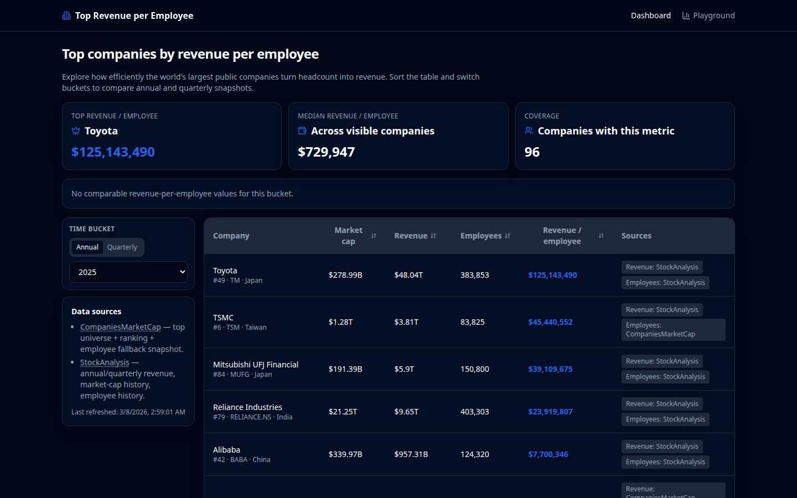
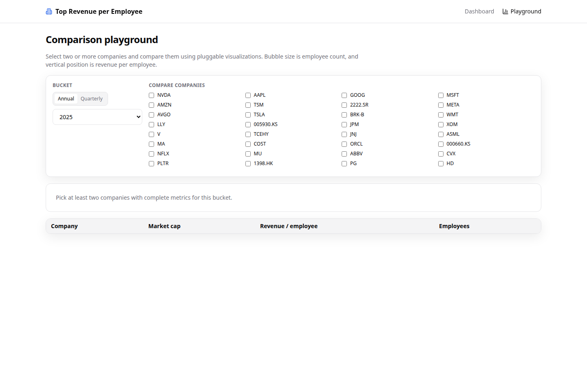

# Top Revenue per Employee

SolidJS + shadcn-style dashboard for exploring the top public companies by market cap and comparing how efficiently they generate revenue per employee.

## Demo screenshots

Dark-mode teaser views from the app:

| Dashboard | Comparison playground |
| --- | --- |
|  |  |

## Features

- **Main dashboard**
  - sleek infographic cards focused on revenue-per-employee leaders,
  - sortable company table (market cap, revenue, employees, revenue / employee),
  - annual + quarterly time-bucket selector (`2025`, `2024Q3`, etc.),
  - visible source attribution in the UI.
- **Comparison playground**
  - select multiple companies,
  - bubble chart comparison (market cap vs revenue per employee, sized by employee count),
  - extensible visualization registry for adding new chart types.
- **Nightly automation**
  - refreshes source data,
  - archives snapshots in the repo,
  - publishes refreshed static site to GitHub Pages.
- **Demo screenshot automation**
  - captures dashboard and playground screenshots with Playwright,
  - stores images in `docs/demo-screenshots/`,
  - refreshes screenshots monthly via GitHub Actions.

## Tech stack

- SolidJS + Vite + TypeScript
- TailwindCSS (shadcn-style component system)
- Node data pipeline scripts (`tsx`)
- GitHub Actions for CI and nightly refresh/deploy

## Data sources

- [CompaniesMarketCap](https://companiesmarketcap.com/)
  - top-company universe by market cap,
  - market-cap ranking baseline,
  - fallback employee snapshot.
- [StockAnalysis](https://stockanalysis.com/)
  - annual/quarterly revenue enrichment,
  - market-cap history enrichment.

> Notes:
> - Employee history coverage differs across companies and exchanges.
> - Where historical employee data is unavailable, a current employee snapshot fallback is used and flagged.

## Local development

```bash
npm install
npm run data:refresh
npm run dev
```

To run demo screenshots locally, install the Playwright browser once:

```bash
npm run screenshots:install
```

### Quality checks

```bash
npm run test
npm run typecheck
npm run build
npm run build:pages
npm run data:validate
npm run screenshots:demo
```

For GitHub Pages-style local validation (repo subpath base URL):

```bash
VITE_BASE_PATH=/top-revenue-per-employee/ npm run build
```

`npm run build:pages` also creates `dist/404.html` for SPA route fallback on GitHub Pages.

## Data pipeline

Refresh dataset and archive snapshots:

```bash
npm run data:refresh
```

Outputs:

- `data/raw/<YYYY-MM-DD>/...` — archived raw source snapshots
- `data/processed/companies-timeseries.json` — normalized intermediate dataset
- `data/processed/metadata.json` — refresh metadata
- `public/data/companies-data.json` — frontend-consumable dataset

## GitHub Actions

- `CI` workflow (`.github/workflows/ci.yml`)
  - validates dataset, runs tests, typechecks, builds, and deploys the static site on pushes to `main`.
- `Nightly Refresh` workflow (`.github/workflows/nightly-refresh-deploy.yml`)
  - runs on schedule + manual trigger,
  - refreshes and commits data changes to `main`,
  - relies on the `CI` workflow to deploy after the `main` branch update lands.
- `Monthly Demo Screenshots` workflow (`.github/workflows/monthly-demo-screenshots.yml`)
  - runs on a monthly schedule + manual trigger,
  - captures demo screenshots with Playwright,
  - commits `docs/demo-screenshots/*` updates to `main` when screenshots change.